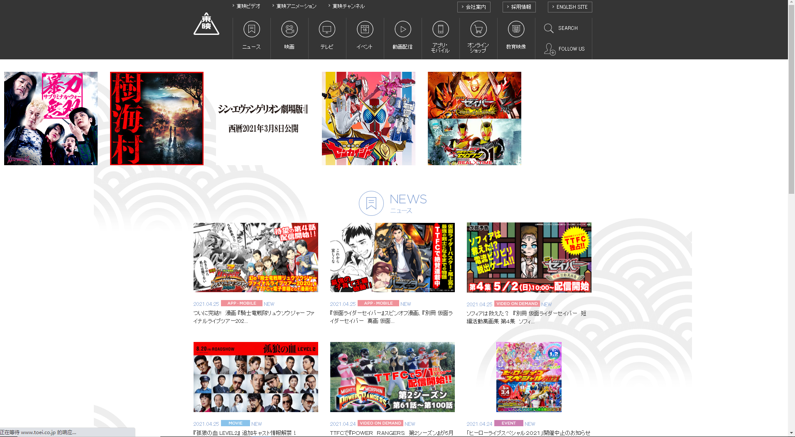
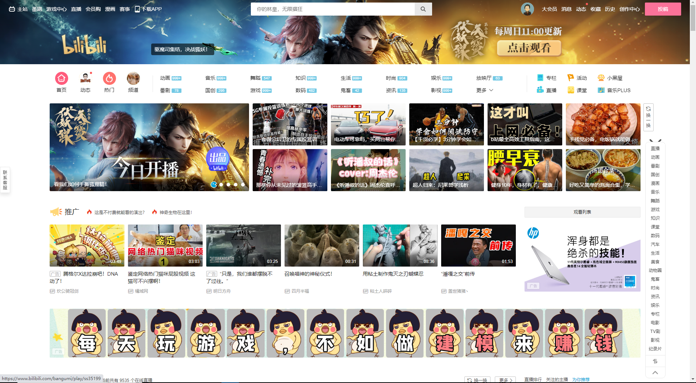

## Animation in world
It is my pleasure to introduce the developement of animation in world to you.  
> Here you can find _[my favourite animation](https://github.com/Opluto/Eng_homework/blob/260f6ed480c7742074b1702a590459c433afedb2/My%20favourtie%20Animation.md)_ .  
## Animation in America
> + Animation is more generally to be called __cartoon__ in America.Cartoon was grading in America,so that children was limited to watch adult cartoon,which contains more elements of violence,sex,boold,in the same time,more profound.  
> > + One of most famous Tv station _[Adult swim](https://www.adultswim.com/)_ is widely fond of by young man.  

  
## Animation in Japan  
> + Japanese animation(also called __Anime__) maybe one of the most popular entertaining pasttime in world.For its various types and delicate stlye.I like it as well.  

  
## Animation in Chian
> + Chinese animation grows very fast in recent years,but it still has a long way to go.  
> > + _[BiliBili](https::/www.bilibili.com)_,a website where animation lover gathered in network,is now very popular between young people in China.  



```javascript
$(document).ready(function () {
    alert('Animation is great!');
});
```
